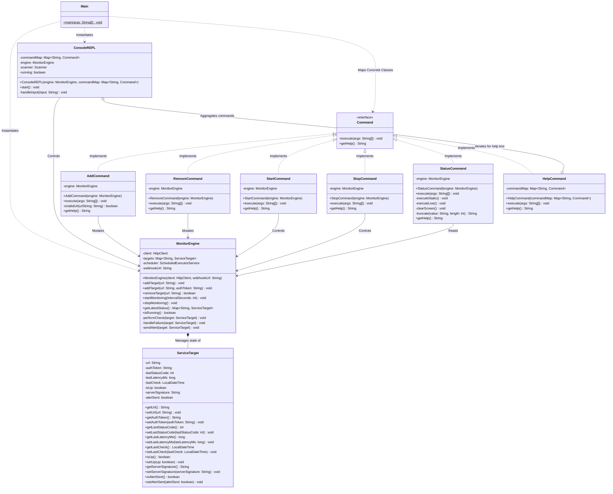

# NodeSentry

**NodeSentry** is a lightweight, terminal-based REPL (Read-Eval-Print Loop) application designed to monitor the health, availability, and performance of web services in real-time. 

Built entirely around Java's modern `java.net.http.HttpClient`, NodeSentry moves away from legacy synchronous requests to provide a highly concurrent, non-blocking monitoring engine. It allows users to dynamically manage a registry of target URLs—ranging from public websites to secured, token-protected APIs—and tracks vital metrics such as latency, HTTP status codes, and server signatures.

## Key Features
* **Asynchronous Networking:** Utilizes `HttpClient.sendAsync()` to ping dozens of endpoints concurrently without freezing the terminal interface.
* **Automated Discord Alerting:** Integrated webhook support that dispatches high-priority alerts to Discord upon service failure, utilizing a state-aware "Alert Sent" memory lock to prevent notification spam.
* **Live Sentry Dashboard:** A real-time, auto-refreshing terminal dashboard that provides a continuous view of service health and infrastructure signatures.
* **Interactive REPL Interface:** A custom command-line interface driven by the **Command Design Pattern** for clean, scalable user input parsing.
* **Authentication Support:** Capable of passing Bearer Tokens/API keys in HTTP headers to monitor private or secured endpoints.
* **Robust Testing Suite:** Comprehensive coverage with over 20 unit tests, utilizing Mockito to simulate complex network failures and validate asynchronous engine logic.
* **Graceful Failure Handling:** Built-in exception handling for DNS resolution errors and network timeouts, ensuring the monitor remains stable even when the internet is not.
* **Thread-Safe Architecture:** Safely shares state between the UI thread and the background `ScheduledExecutorService` using `ConcurrentHashMap` and `volatile` state flags.

## Tech Stack & Architecture
* **Language:** Java 21+
* **Build Tool:** Maven
* **Core Libraries:** `java.net.http.HttpClient`, `java.util.concurrent`
* **Testing:** `JUnit 5`, `Mockito`

### System Architecture
NodeSentry strictly enforces a separation of concerns. The `MonitorEngine` handles all complex I/O and threading, while the `ConsoleREPL` handles user interactions. They communicate strictly through decoupled `Command` objects.

## Getting Started

### Prerequisites
* Java Development Kit (JDK) 21 or higher installed.
* Apache Maven installed.

### Installation & Execution
1. **Clone the repository:**
   `git clone https://github.com/xniebuhr/NodeSentry.git`
   `cd NodeSentry`

2. **Compile the project using Maven:**
   `mvn clean compile`

3. **Run the application:**
   `mvn exec:java "-Dexec.mainClass=com.sentry.Main"`

## Usage Commands
Once the REPL is running, use the following commands to interact with the engine:

| Command | Arguments | Description |
| :--- | :--- | :--- |
| `add` | `<url> [authToken]` | Adds a new target to the monitoring pool. Auth token is optional. |
| `remove` | `<url>` | Removes a specific URL from the monitoring pool. |
| `start` | `<interval_in_seconds>` | Spawns a background thread to begin pinging all targets at the set interval. |
| `stop` | None | Safely halts the background monitoring thread. |
| `status` | `[live]` | Prints a formatted table of all targets. Use `status live` for a dashboard that refreshes every 2s (Press ENTER to exit). |
| `help` | None | Displays a list of available commands. |
| `exit` | None | Shuts down the application and halts all active threads. |

---
*Developed as a demonstration of Java Concurrency, Asynchronous I/O, and Object-Oriented Design Patterns as the final project of my Object Oriented Software Engineering Fundamentals class.*